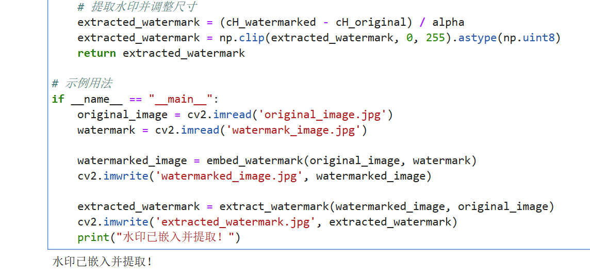

# 基于小波变换的盲水印算法设计

## 安装
```bash
pip install blind-watermark 
```


## 运行步骤
1：将examp_str.py文件和watermark_image.jpg文件以及original_image.jpg文件放在同一个文件夹中


2：运行examp_str.py文件


3：在运行成功后将出现运行成功的提示以及extracted_watermark.jpg文件和watermarked_image.jpg文件


## Python 中使用


参考 [代码](/example_str.py)


嵌入水印
```python
    cH_watermarked = cH + alpha * watermark
    watermarked_coeffs = (cA, (cH_watermarked, cV, cD))
```

提取水印
```python
extracted_watermark = (cH_watermarked - cH_original) / alpha
extracted_watermark = np.clip(extracted_watermark, 0, 255).astype(np.uint8)
return extracted_watermark 
```


## 运行实例

```python
if __name__ == "__main__":  
    original_image = cv2.imread('original_image.jpg')
    watermark = cv2.imread('watermark_image.jpg')  

    watermarked_image = embed_watermark(original_image, watermark)  
    cv2.imwrite('watermarked_image.jpg', watermarked_image)  

    extracted_watermark = extract_watermark(watermarked_image, original_image)  
    cv2.imwrite('extracted_watermark.jpg', extracted_watermark)  
    print("水印已嵌入并提取！")
```


## 运行结果


### 运行代码前
原图和水印


  
### 运行代码后
运行后的图片

  


### 代码运行截图





## 源代码

```python
if __name__ == "__main__":  
    original_image = cv2.imread('original_image.jpg')
    watermark = cv2.imread('watermark_image.jpg')  

    watermarked_image = embed_watermark(original_image, watermark)  
    cv2.imwrite('watermarked_image.jpg', watermarked_image)  

    extracted_watermark = extract_watermark(watermarked_image, original_image)  
    cv2.imwrite('extracted_watermark.jpg', extracted_watermark)  
    print("水印已嵌入并提取！")
```

